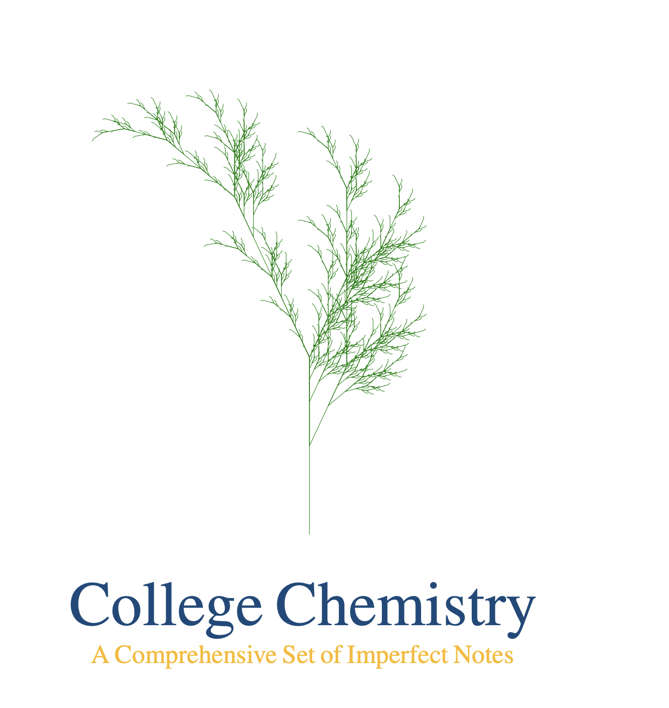

[![Contributors][contributors-shield]][contributors-url]
[![Forks][forks-shield]][forks-url]
[![Issues][issues-shield]][issues-url]
[![MIT License][license-shield]][license-url]


<div align="center">
  <a href="https://github.com/TorresAWS/CollegeChemistry">
    
  </a>

  <h3 align="center">College Chemistry Open Textbook</h3>

  <p align="center">
  A College & GOB Chemistry open textbook develoepd as code at CUNY
    <br />
    <a href="https://github.com/TorresAWS/CollegeChemistry/tree/master?tab=readme-ov-file"><strong>Explore the files </strong></a>
    <br />
    <br />
    <a href="https://github.com/TorresAWS/CollegeChemistry/tree/pdf">Latest books</a>·
    <a href="https://github.com/TorresAWS/CollegeChemistry/issues/new?labels=bug&template=bug-report---.md">Submit Correction</a>·
    <a href="https://github.com/TorresAWS/CollegeChemistry/issues/new?labels=enhancement&template=feature-request---.md">Add Content</a>
  </p>
  

  
  
  
</div>


<!-- TABLE OF CONTENTS -->
<details>
  <summary>:book: Table of Contents</summary>
  <ol>
    <li>
      <a href="#a-pretty-free-textbooks-developed-as-computer-code">About The Project</a>
      <ul><li><a href="#pretty-textbooks-Tuftes-vision">Pretty textbooks</a></li></ul>
      <ul><li><a href="#Open-textbooks-the-age-of-free-ugly-textbooks">Open textbooks</a></li></ul>
      <ul><li><a href="#textbooks-as-code">Textbooks as code</a></li></ul>
    </li>
    <li><a href="#roadmap">Roadmap</a></li>
    <li><a href="#contributing">Contributing</a></li>
    <li><a href="#license">License</a></li>
    <li><a href="#built-with">Built With</a></li>
    <li><a href="#contact">Contact</a></li>
    <li><a href="#acknowledgments">Acknowledgments</a></li>
  </ol>
</details>


 ## A pretty, free textbooks developed as code :wave:
 
This project is a student's dream: a free, elaborate General chemistry textbook with a pretty layout, covering a wide variety of content and including numerous answered exercises. 
This project is also a techie instructor's dream: a book developed as code, that can be collaboratively improved, updated, and extended.

 ### Pretty textbooks: Tufte's vision
 
What makes a textbook pretty, when beauty is subjective:
* The layout: <a href="https://en.wikipedia.org/wiki/Edward_Tufte">Tufte's</a> layout gives space to the text placing images side by side with the content :sunglasses:
* A good quality table of contents, detailed and with images :scream:
* A tightly-knitted problem section :fire:
* A healthy amount of images :boom:

 ### Open textbooks: the age of free, ugly, textbooks 
 
The open textbook wave took over higher education several years ago. Nowadays, students do not need to pay for expensive college textbooks :smirk:. They can find good-quality textbooks (see <a href="https://openstax.org/">OpenStax</a>) and web resources (see <a href="https://open.umn.edu/opentextbooks">UMN library</a>) developed by the education community. Still, those resources are not pretty enough and they need to be beautified. An example is the OpenStax books which are good books but still don't look like regular, commercial textbooks. Editorials spend a lot of time and money in developing templates. Those templates are reviewed and improved as a textbook is re-edited and improved. In the sciences where numerous images and diagrams accompany textbooks, these templates are the key to making a textbook look pretty, and at the same time, they give a certain style to the books.

 ### Textbooks as code 
 
This project envisions a textbook as computer software. Just like a complex app, good textbooks have an elaborate front end and a strong backend supports the front. This is particularly critical for the sciences, where textbooks are filled with thousands of numerical problems, or multiple-choice questions. Those questions can be placed in databases being retribed not only when the textbook is going for print, but also when the content needs to be delivered through a web portal. More importantly, the development of a textbook is similar to the development of code.

Why is it convenient to develop textbooks as code:
* Quality assurance: textbook develoment goes through cycles of improvement just like code. Collaborative code reviews can ensure quality
* Versatility: textbook content (e.g. problems, text) can be delivered in multiple formats (e.g. pdf book, pdf quizes, web-base content, online learning management systems content). Codep-based content can delivered in all those formats.

<p align="right">(<a href="#readme-top">back to top</a>)</p>


 <!-- ROADMAP -->
## Roadmap

- [x] Have an alpha-working version of the textbook compilable for GOB and College Chemistry
- [x] Have an alpha-working version of the lab manuals with versions for GOB and College Chemistry
- [ ] clean up the chapter branches leaving only files, images, problems, Ch-name, Ch-nameProblems files
- [ ] Organize chapters in a set of content folders (into, section, solved problem, end of chapter problems)
- [ ] CI/CD that automatically compiles the pdf after an approved master PR
- [ ] protect the answers

See the [open issues](https://github.com/TorresAWS/CollegeChemistry/issues) for a full list of proposed features (and known issues).

<p align="right">(<a href="#readme-top">back to top</a>)</p>


<!-- CONTRIBUTING -->
## Contributing

Let's say you want to edit any of the chapters (e.g. Ch-measurements): any contributions you make are **greatly appreciated**. Here we assume you have Git installed and configured in your local computer:
Do the following:
1. Fork the Project in your GitHub account
2. Clone the branch in your computer 
```sh
git clone --single-branch --branch Ch-measurements  git@github.com:TorresAWS/CollegeChemistry.git
```
3. Start git
```sh
git init
```
4. Make a new branch refering to the chapter's name  
```sh
git checkout -b  edittypos
```
5. Edit the chapter and implements any changes
6. Submit changed back to GitHub  
```sh
git add . ; git commit -m "edited chapter "; git push origin Ch-measurements/edittypos
```
7. Open a Pull Request

If you have a suggestion that would make this better, please fork the repo and create a pull request. You can also simply open an issue with the appropiate tag.
Don't forget to give the project a star! Thanks again!


### Top contributors:

<a href="https://github.com/TorresAWS/CollegeChemistry/graphs/contributors">
  
</a>

<p align="right">(<a href="#readme-top">back to top</a>)</p>


 ## License
Distributed under the <a href="https://github.com/TorresAWS/CollegeChemistry/graphs/contributors">
Creative Commons License.  
</a>

<p align="right">(<a href="#readme-top">back to top</a>)</p>

## Built With

This project was built mainly with Latex, and images were developed using TikZ. The latex Tufte text template was used as a building block of the two-column text structure. Tikz allows the creation of vector graphics built fresh when the code (book) is compiled. Images can be shrunk without losing image quality. A series of bash and python scripts was used to compile the code.

[![JQuery][Latex-badge]][Latex.com]
[![Bash][Bash-badge]][Bash.com]
[![Python][Python-badge]][Python.com]

<p align="right">(<a href="#readme-top">back to top</a>)</p>


 ## Contact
 materialsstemlab@gmail.com
<p align="right">(<a href="#readme-top">back to top</a>)</p>


 ## Acknowledgments


* [CUNY Open educational Community](https://www.cuny.edu/libraries/open-educational-resources/)
<p align="right">(<a href="#readme-top">back to top</a>)</p>


<!-- MARKDOWN LINKS & IMAGES -->
<!-- https://www.markdownguide.org/basic-syntax/#reference-style-links -->
[contributors-shield]: https://img.shields.io/github/contributors/TorresAWS/CollegeChemistry.svg?style=for-the-badge
[contributors-url]: https://github.com/TorresAWS/CollegeChemistry/graphs/contributors
[forks-shield]: https://img.shields.io/github/forks/TorresAWS/CollegeChemistry.svg?style=for-the-badge
[forks-url]: https://github.com/othneildrew/Best-README-Template/network/members
[issues-shield]: https://img.shields.io/github/issues/TorresAWS/CollegeChemistry.svg?style=for-the-badge
[issues-url]: https://github.com/TorresAWS/CollegeChemistry/issues
[license-shield]: https://img.shields.io/github/license/TorresAWS/CollegeChemistry.svg?style=for-the-badge
[license-url]: https://github.com/TorresAWS/CollegeChemistry/blob/master/LICENSE
[product-screenshot]: images/screenshot.png
[Next.js]: https://img.shields.io/badge/next.js-000000?style=for-the-badge&logo=nextdotjs&logoColor=white
[Next-url]: https://nextjs.org/
[React.js]: https://img.shields.io/badge/React-20232A?style=for-the-badge&logo=react&logoColor=61DAFB
[React-url]: https://reactjs.org/
[Vue.js]: https://img.shields.io/badge/Vue.js-35495E?style=for-the-badge&logo=vuedotjs&logoColor=4FC08D
[Vue-url]: https://vuejs.org/
[Angular.io]: https://img.shields.io/badge/Angular-DD0031?style=for-the-badge&logo=angular&logoColor=white
[Angular-url]: https://angular.io/
[Svelte.dev]: https://img.shields.io/badge/Svelte-4A4A55?style=for-the-badge&logo=svelte&logoColor=FF3E00
[Svelte-url]: https://svelte.dev/
[Laravel.com]: https://img.shields.io/badge/Laravel-FF2D20?style=for-the-badge&logo=laravel&logoColor=white
[Laravel-url]: https://laravel.com
[Bootstrap.com]: https://img.shields.io/badge/Bootstrap-563D7C?style=for-the-badge&logo=bootstrap&logoColor=white
[Bootstrap-url]: https://getbootstrap.com
[JQuery.com]: https://img.shields.io/badge/jQuery-0769AD?style=for-the-badge&logo=jquery&logoColor=white
[JQuery-url]: https://jquery.com 

[Bash-badge]: https://img.shields.io/badge/Bash-4EAA25?style=for-the-badge&logo=gnubash&logoColor=white
[Bash.com]: https://www.gnu.org/software/bash/manual/
[Latex-badge]: https://img.shields.io/badge/-LaTeX-008080?style=flat&logo=latex&logoColor=white
[Latex.com]: https://www.latex-project.org/
[Python-badge]: https://img.shields.io/badge/python-3670A0?style=for-the-badge&logo=python&logoColor=ffdd54
[Python.com]: https://www.python.org/


